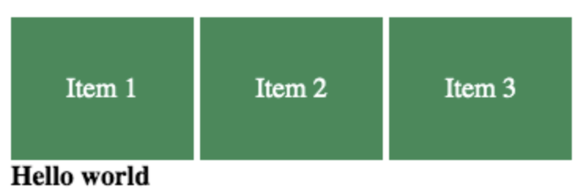
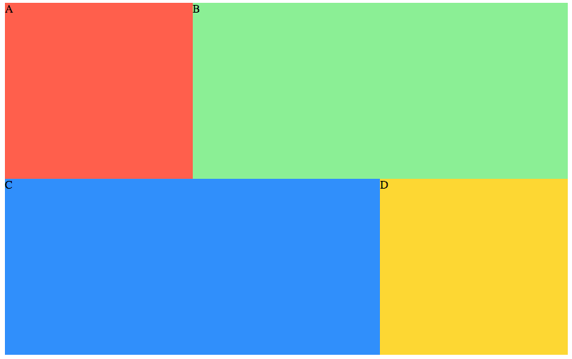
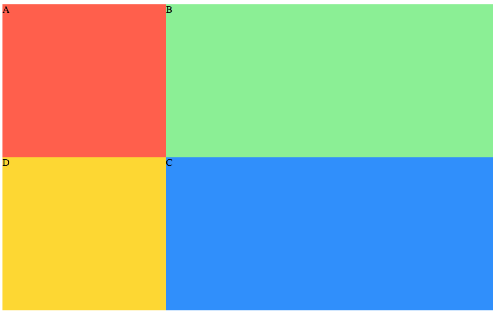
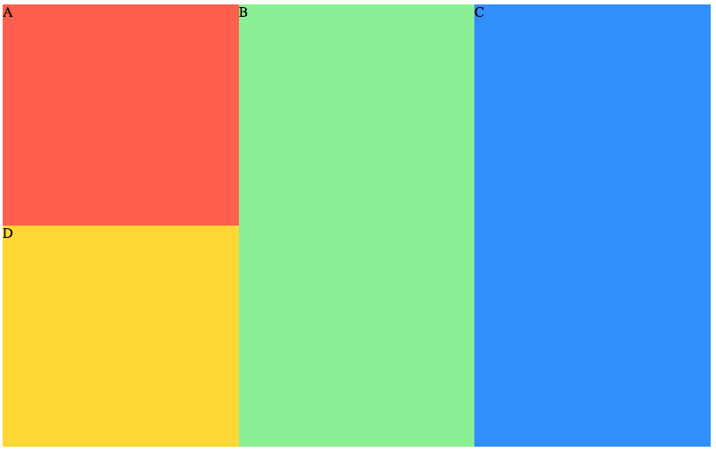
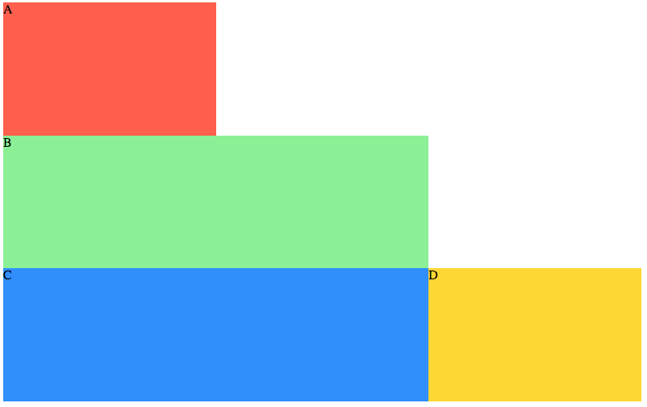
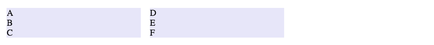
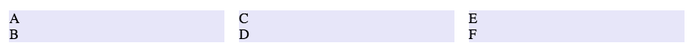
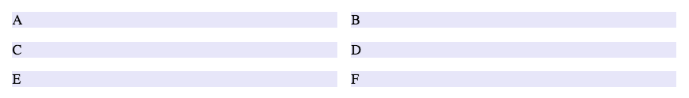
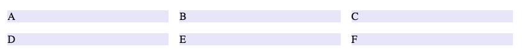
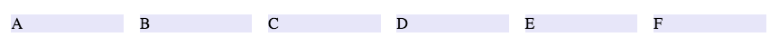

# Quiz Questions <!-- omit in toc -->

## Lessons <!-- omit in toc -->
- [A1: Document Outline](#a1-document-outline)
- [A5: Intro to CSS](#a5-intro-to-css)
- [A6: Lists](#a6-lists)
- [A8: Sections & Structure](#a8-sections--structure)
- [B1: Setting up a Project](#b1-setting-up-a-project)
- [B4: Box Model Spacing](#b4-box-model-spacing)
- [B7: Typesetting](#b7-typesetting)
- [C2: Selectors & Cascading](#c2-selectors--cascading)
- [C8: Element Display](#c8-element-display)
- [C9: Flex layout](#c9-flex-layout)


## A1: Document Outline

---

When reading an a web document from top to bottom, if the first heading encountered is an `<h1>`, the second heading encountered is an `<h2>`, what type of element will the third heading encountered from the top be?

- [x] Not certain: The heading type is always determined by the content
- [ ] Definitely `<h3>`: Because it's the third heading from the top
- [ ] Definitely either `<h2>` or `<h1>`

*An outline is built hierarchically, not chronologically. The heading is likely an `<h2>` or `<h3>`, but never certain without additional context*

---

Given the following web document as viewed in a browser, it is reasonable to assume the "Middle" heading is an `<h1>`?

```
Image of three headings, where the middle heading ("Middle") is bigger than the first and third
```

- [x] false
- [ ] true

*The size of the elements visually is never an accurate indication of type*

---

Given the following outline, determine the appropriate heading element type for each story heading:

```
Book Title
Chapter 1
Scene
Location
Chapter 2
Chapter 3
```
_**Tricky one here, will need a stronger example**_

---

## A5: Intro to CSS


Which THREE (3) the following are valid values that can be assigned to the CSS property `color`, resulting in the affected element's text appearing red

- [x] red
- [x] #ff0000
- [x] rgb(255,0,0)
- [ ] #red
- [ ] red(255,0,0)
- [ ] #255,0,0

---

## A6: Lists

---

## A8: Sections & Structure

Which of the below options best describes the following HTML elements: `<section>`, `<div>`, `<article>`, `<nav>`?

- [x] Block elements
- [ ] Form elements
- [ ] Semantic elements
- [ ] Inline elements


---

## B1: Setting up a Project

Which of the following is true about the `<body>`?

- [x] The `<body>` will hold the physical elements that build the document's structure
- [ ] The `<body>` goes between the `<header>` and `<footer>`
- [ ] The `<body>` is the first element the browser looks for
- [ ] All of these answers are true


## B4: Box Model Spacing

Assessing only code given below, for each of the 3 classes defined below, when any is applied to a "block" element (`display: block`), it will create a space around all sides of that element of at least `1rem` in length: 

- [x] true
- [ ] false

### CSS <!-- omit in toc -->
```css
.only-one {
   margin: 1rem;
}
.just-one {
   margin: 1rem 1rem;
}
.all-four {
   margin-top: 1rem;
   margin-right: 1rem;
   margin-bottom: 1rem;
   margin-left: 1rem;
}
```

## B7: Typesetting

Given the following HTML and CSS defined, which of the statements is true:

- [x] The text within both paragraphs is aligned to the center of the element
- [ ] The text within both paragraphs is justified to the edge of the element
- [ ] The first paragraph's text is right aligned, the second paragraph's text is justified to the edges
- [ ] The first paragraph's text is left aligned, the second paragraph's text is aligned to the center
- [ ] The first paragraph's text is aligned to the center, the second paragraph's text is justified to the edges

### CSS <!-- omit in toc -->
```css
body { text-align: justify; }
section { text-align: left; }
p { text-align: center; }
```

### HTML <!-- omit in toc -->
```html
<body>
   <section class="right-align">
      <p>the first paragraph</p>
   </section>
   <p>the second paragraph</p>
</body>      
```

---

## C2: Selectors & Cascading

Assessing only code below, what colour will the text within the `<section>` element from the HTML block be displayed to the user in the browser, given the CSS rules defined in the CSS block:

- [x] Red
- [ ] Green
- [ ] Blue
- [ ] The browser's default option

### CSS <!-- omit in toc -->
```css
.green { color: green; }
.red { color: red; }
section { color: blue; }
```

### HTML <!-- omit in toc -->
```html
<section class="red green">Lorem ipsum...</section>
```


## C8: Element Display

Assessing only code given below, does the following HTML and CSS snippets create the exact "browser output" below?

- [x] false
- [ ] true

### CSS <!-- omit in toc -->
```css
ul {
   list-style: none;
   margin: 0;
   padding: 0;
}
li {
   background-color: seagreen;
   color: white;
   padding: 2em;
   display: inline;
}
```

### HTML <!-- omit in toc -->
```html
<nav>
   <ul>
      <li>Item 1</li>
      <li>Item 2</li>
      <li>Item 3</li>
   </ul>
</nav>
<strong>Hello world</strong>
```

### BROWSER OUTPUT <!-- omit in toc -->


---

The declaration `display: invisible;` applied as part of a rule, will make the elements the rule applies to disappear from the visible layout

- [x] false
- [ ] true


## C9: Flex layout

Assessing only code given below, which of the following images best reflected the expected browser output?

### BROWSER OUTPUT <!-- omit in toc -->
- [x] 
- [ ] 
- [ ] 
- [ ] 

### HTML <!-- omit in toc -->
```html
<div class="layout">
   <div class="item a">A</div>
   <div class="item b wider">B</div>
   <div class="item c wider">C</div>
   <div class="item d">D</div>
</div>
```

### CSS <!-- omit in toc -->
```css
.layout {
   display: flex;
   width: 800px;
   height: 500px;
   flex-wrap: wrap;
}
.item { flex-basis: 33.33%; /* behaves like width */ }
.a { background-color: tomato; }
.b { background-color: lightgreen; }
.c { background-color: dodgerblue; }
.d { background-color: gold; }
.wider { flex-basis: 66.66%; /* behaves like width */ }
```

---

Assessing only code given below, which of the following images best reflected the expected browser output?

### BROWSER OUTPUT <!-- omit in toc -->
- [x] 
- [ ] 
- [ ] 
- [ ] 
- [ ] 

### HTML <!-- omit in toc -->
```html
<main class="flex-container">
   <article class="row">
      <section class="item">A</section>
      <section class="item">B</section>
      <section class="item">C</section>
   </article>
   <article class="row">
      <section class="item">D</section>
      <section class="item">E</section>
      <section class="item">F</section>
   </article>
</main>
```

### CSS <!-- omit in toc -->
```css
.flex-container {
   display: flex;
}
.item {
   background: lavender;
   margin: 0 0.5rem;
}
```
