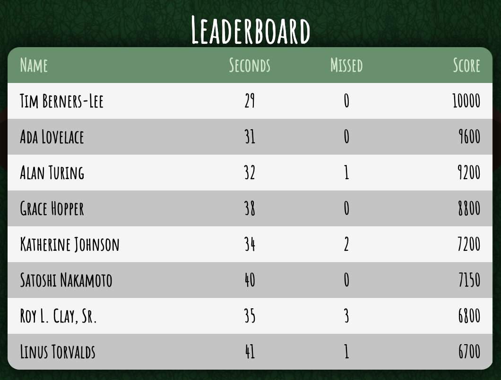

# B-05: Tables

Using the following image as a guide, create the following table with eight sample rows



For the data, you may use the following content to populate the table with sample data:

```
Tim Berners-Lee / 29 / 0 / 10000
Ada Lovelace / 31 / 0 / 9600
Alan Turing / 32 / 1 / 9200
Grace Hopper / 38 / 0 / 8800
Katherine Johnson / 34 / 2 / 7200
Satoshi Nakamoto / 40 / 0 / 7150
Roy L. Clay, Sr. / 35 / 3 / 6800
Linus Torvalds / 41 / 1 / 6700
```

## Part 1: Structure
1. Create a `<table>` element within the `<body>` of the HTML document
1. Add a `<thead>`, which will consist of a single **row**, and four (4) **headings**: Name, Seconds, Missed, Score
1. Add a `<tbody>`, which within, will have eight (8) rows of example data. Each of the rows will have four (4) **data** items to align below the appropriate headings. Use the sample data provided above
1. Add a `<caption>` to the table, wrapping around the text "Leaderboard"
